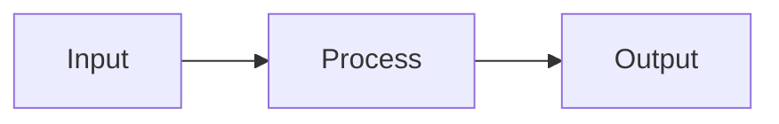

# Documentation Skill: Gradual Exploration Process

## Purpose

A systematic process for writing technical documentation that progressively reveals context, tradeoffs, and techniques so readers build a coherent mental model.

## When to Apply

- Writing developer documentation (SDKs, APIs, CLIs)
- Creating onboarding materials
- Documenting complex systems with multiple components
- Any documentation that needs to build understanding progressively

---

## Philosophy

Documentation is **gradual exploration**, not persuasion. Each topic progressively reveals context, tradeoffs, techniques, and benefits so the whole system makes sense.

**Core principle:** The reader should never encounter a concept that requires knowledge they haven't yet encountered.

---

## Phases and Levels

### PHASES: Iterative Rounds

Each run through the documentation process is a **PHASE**. Iterate when new information changes assumptions:

```
PHASE 1: Initial pass through the process
    |
    v
[New information encountered?] --yes--> Double back, start PHASE 2
    |
    no
    v
PHASE complete
```

**Phase tracking:**
- Each phase produces output in a named document (e.g., `TOPIC_PHASE_1.md`)
- Later phases incorporate learnings from earlier phases
- Phase documents preserve the evolution of thinking

**When to start a new phase:**
- New information changes assumptions
- Contradictions discovered that need resolution
- Feedback received that requires rework
- Deeper understanding reveals gaps in earlier work

### LEVELS: Criticality Prioritization

Not all documentation sections are equally critical. **LEVEL** indicates priority:

| Level | Criticality | Examples | Priority |
|-------|-------------|----------|----------|
| L0 | Critical | Getting Started, Core Concepts | Must do first |
| L1 | Important | Main workflows, Deployment | Do after L0 |
| L2 | Supporting | Cookbook, Advanced Topics | Do after L1 |
| L3 | Reference | Appendices, Glossary, FAQ | Do last |

**Work order:** Complete L0 before L1, L1 before L2, etc. Within each level, follow the 7-step process for each section.

---

## The 8-Step Process

```
+-------------------------------------------------------------------------+
|                      DOCUMENTATION PROCESS                              |
+-------------------------------------------------------------------------+
|                                                                         |
|  0. PRE-FLIGHT      Check prerequisites, map dependencies               |
|        |                                                                |
|  1. SCOPE           Define topic, identify target persona               |
|        |                                                                |
|  2. SOURCE          Gather verified sources, mark confidence levels     |
|        |                                                                |
|  3. OUTLINE         Structure content following the 7-step pattern      |
|        |                                                                |
|  4. DRAFT           Write first pass, preserving source traceability    |
|        |                                                                |
|  5. VERIFY          Confirm all technical claims against current source |
|        |                                                                |
|  6. CONTRADICTION   Note inconsistencies, explain why they exist        |
|        |                                                                |
|  7. CONNECT         Add cross-references, navigation, next steps        |
|        |                                                                |
|  8. PUBLISH         Remove internal references, prepare for public      |
|        |                                                                |
+-------------------------------------------------------------------------+
```

---

## Step 0: Pre-Flight

**Goal:** Ensure we're ready to write this document.

**Checklist:**
- [ ] Prerequisite docs exist (or are being written in parallel)
- [ ] This doc's place in reader journeys is clear
- [ ] Glossary terms needed are defined (or will be added)
- [ ] No blocking TODOs that should be resolved first

**Dependency mapping:**
```markdown
## Dependencies
Requires: [list docs that must exist before this one]
Unlocks: [list docs that can be written after this one]
```

---

## Signals to Double Back

During any step, watch for these signals that require starting a new PHASE:

| Signal | Meaning | Action |
|--------|---------|--------|
| **Source conflict** | Two authoritative sources disagree | Stop, resolve conflict, may need new phase |
| **Missing prerequisite** | Doc assumes knowledge we haven't documented | Stop, write prerequisite first |
| **Scope creep** | Topic is larger than expected | Split into multiple docs, adjust plan |
| **Contradiction discovered** | Reality differs from what we wrote | Note it, may need to revise earlier sections |
| **Reader journey broken** | No clear path to/from this doc | Fix navigation before proceeding |
| **Glossary gap** | Using terms we haven't defined | Add to glossary immediately |

**When to start new phase vs. fix in place:**
- Minor fixes: Fix in current phase
- Structural changes: New phase
- New information that changes assumptions: New phase

---

## Step 1: Scope

**Goal:** Define what you're documenting and for whom.

**Questions to answer:**
- What specific topic/feature/concept?
- Which persona needs this?
- What should the reader be able to do after reading?
- What prerequisite knowledge is assumed?

**Output:**
```markdown
## Topic: [Name]
Persona: [e.g., Developer, Operator, Both]
Reader Goal: [e.g., "Deploy connector in service mode"]
Prerequisites: [e.g., "Completed Getting Started"]
```

**Anti-patterns:**
- Too broad ("Everything about X") - split into multiple docs
- No clear outcome ("About permissions") - define what reader can do
- Assuming too much - be explicit about prerequisites

---

## Step 2: Source

**Goal:** Gather authoritative sources and mark confidence levels.

**Source authority hierarchy:**
| Source | Authority Level | Use For |
|--------|-----------------|---------|
| Source code | Ground truth | Implementation details |
| Official docs | High | Concepts, patterns |
| Team knowledge | Medium | Intent, rationale |
| External docs | Medium | May be stale |

**Confidence markers:**
- `[VERIFIED]` - Read source this session, citation confirmed
- `[INFERRED]` - Synthesized from multiple sources
- `[GENERATED]` - Example content not from source
- `[UNVERIFIED]` - Believed true but not confirmed this session

**Output:**
```markdown
## Sources
| Source | Location | Key Points |
|--------|----------|------------|
| ... | ... | [VERIFIED] ... |
```

**Anti-patterns:**
- Citing without reading (verify every claim)
- Trusting docs over code (code is ground truth)
- Using aggregate statistics that are hard to contextualize

---

## Step 3: Outline

**Goal:** Structure content using the 7-step exploration pattern.

### The 7-Step Pattern

```
1. ORIENT       What system are we in? What problem does it solve?
                Goal: Reader knows they're in the right place

2. CONTEXTUALIZE Where does this fit? What comes before/after?
                 Goal: Reader has spatial awareness

3. EXPLAIN      How does this work? What are the moving parts?
                Goal: Reader understands the mechanism

4. TRADEOFFS    Why this approach? What alternatives were considered?
                Goal: Reader understands the reasoning

5. DEMONSTRATE  Show it working. Concrete example with real output.
                Goal: Reader sees it in action

6. EDGE CASES   What breaks? What's partial? What's aspirational?
                Goal: Reader has accurate expectations

7. CONNECT      Where to go next? What's related?
                Goal: Reader has clear path forward
```

**Adapting by content type:**

| Content Type | Emphasize | De-emphasize |
|--------------|-----------|--------------|
| Conceptual | Orient, Contextualize, Tradeoffs | Demonstrate |
| Procedural | Demonstrate, Edge Cases | Tradeoffs |
| Reference | Explain, Edge Cases | Orient |
| Troubleshooting | Edge Cases, Connect | Contextualize |

---

## Step 4: Draft

**Goal:** Write first pass while preserving source traceability.

**Writing guidelines:**

1. **Start with the specific, not the abstract**
   - Bad: "Connectors facilitate access management integration"
   - Good: "A connector syncs users, groups, and permissions from Okta into the platform"

2. **Use rhetorical questions sparingly to introduce topics**
   - Example: "What happens when a user leaves the company but still has access to your production database?"
   - Use one per major section, not every paragraph

3. **Show before explaining**
   ```
   # Good structure
   Here's what running a sync looks like:
   $ tool sync --config $CONFIG
   [output]

   This command: [explanation]

   # Bad structure
   Syncing involves three phases. First... [explanation]
   [code example buried later]
   ```

4. **Use active voice and second person**
   - Bad: "The connector is built using make build"
   - Good: "Build your connector with make build"

5. **Preserve source traceability inline**
   ```markdown
   The SDK processes all builders together for each phase [VERIFIED: source.go L42].
   ```

6. **One idea per paragraph**

---

## Step 5: Verify

**Goal:** Confirm all technical claims against current source.

**Verification checklist:**
- [ ] Every code example runs successfully
- [ ] All CLI flags exist in current binary
- [ ] All SDK methods exist in current version
- [ ] All file paths are correct
- [ ] All line number citations are accurate

**Output:** Verified draft with all `[UNVERIFIED]` markers resolved.

---

## Step 6: Contradiction

**Goal:** Note inconsistencies honestly and explain why they exist.

**How to document contradictions:**

Bad:
```markdown
All connectors support provisioning.
```

Good:
```markdown
Connectors may support provisioning operations.
Check the connector's capability manifest to see which operations are supported.
```

**The principle:** Present the current state in the best possible light with no inaccuracy. Acknowledge limitations, explain why they exist, show the path forward.

---

## Step 7: Connect

**Goal:** Add cross-references, navigation, and clear next steps.

**Connection types:**
1. **Prerequisites** - What the reader should have done first
2. **Related topics** - Concepts that deepen understanding
3. **Next steps** - Where to go after this topic
4. **Cross-references** - Inline links to referenced concepts

**Navigation audit:**
- [ ] Every mentioned concept links to its definition
- [ ] Clear "what's next" at the end
- [ ] No dead-end pages
- [ ] Prerequisites are linked, not just listed

---

## Step 8: Publish

**Goal:** Prepare document for public consumption.

**Checklist:**
- [ ] Remove all references to internal locations (private repos, local paths)
- [ ] Replace internal citations with public links where available
- [ ] Remove or generalize internal statistics
- [ ] Ensure no internal project names remain
- [ ] Verify all links point to publicly accessible resources

---

## Quality Checklist

Before publishing any documentation:

### Accuracy
- [ ] All code examples tested and working
- [ ] All CLI commands verified in current version
- [ ] No `[UNVERIFIED]` markers remain

### Clarity
- [ ] Starts with specific, concrete content
- [ ] One idea per paragraph
- [ ] Active voice, second person
- [ ] No jargon without definition

### Completeness
- [ ] 7-step pattern followed (adapted for content type)
- [ ] Edge cases documented
- [ ] Contradictions acknowledged
- [ ] Tradeoffs explained

### Navigation
- [ ] Prerequisites linked
- [ ] Related topics linked
- [ ] Next steps provided
- [ ] No dead ends

---

## Content Type Templates

### Conceptual Topic Template
```markdown
# [Concept Name]

[One sentence: what is this concept]

## Why This Matters

[Context: where this fits, what it enables]

## How It Works

[Explanation with diagram if helpful]

## Key Tradeoffs

| Approach | Pros | Cons |
|----------|------|------|
| ... | ... | ... |

## Example

[Concrete illustration]

## Related Topics

- [Link 1]
- [Link 2]
```

### Procedural Topic Template
```markdown
# [Task Name]

[One sentence: what you'll accomplish]

## Prerequisites

- [Prerequisite 1]
- [Prerequisite 2]

## Steps

### 1. [First Step]

[Instruction]

```bash
[command]
```

Expected output:
```
[output]
```

### 2. [Second Step]

...

## Troubleshooting

### [Common Problem 1]

[Solution]

## Next Steps

- [What to do next]
```

### Reference Topic Template
```markdown
# [API/Command/Type Name]

[One sentence description]

## Signature

```
func Name(params) returns
```

## Parameters

| Parameter | Type | Required | Description |
|-----------|------|----------|-------------|
| ... | ... | ... | ... |

## Returns

[Description of return values]

## Example

```
[working example]
```

## See Also

- [Related reference]
```

---

## Assertion Verification Pass

Before publishing, verify assertions against real implementations:

**Process:**
1. Extract every assertion (claims, patterns, recommendations) from the document
2. Review each assertion against source code/implementations
3. Identify nuances, edge cases, and exceptions
4. Update documentation to reflect reality

**Output format:**

| Section | Assertion | Status | Nuance Found |
|---------|-----------|--------|--------------|
| ... | ... | Verified/Partial/Wrong | ... |

**Purpose:**
- Catch subtle inaccuracies before publication
- Discover real-world patterns not yet documented
- Build confidence in documentation accuracy

---

## AI-Voice Audit Pass

Before publishing, review for passages that read as "written by AI."

**Red flags to look for:**

| Pattern | Example | Fix |
|---------|---------|-----|
| Generic hedging | "It's important to note that..." | Delete or be specific |
| Filler transitions | "Additionally, furthermore, moreover" | Use simpler connectives or restructure |
| Vague enthusiasm | "This powerful feature enables..." | Name the specific capability |
| Passive padding | "It should be noted that X can be done" | "Do X" |
| List-itis | Every section is a bullet list | Vary structure, use prose |
| Over-qualification | "In many cases, depending on..." | State the common case, note exceptions |
| Missing specifics | "Various options are available" | Name the options |
| Robotic consistency | Every section follows identical structure | Vary rhythm |
| Unnecessary words | "by following this workflow" | "with this workflow" |
| Weak constructions | "There is a tool that..." | "The tool..." |
| Ability phrases | "the ability to X" | "can X" |

**Process:**
1. Read document aloud (or use text-to-speech)
2. Flag passages that sound like corporate boilerplate
3. For each flagged passage: delete, simplify, or add specifics
4. Verify the rewritten version sounds like a person explaining to a colleague

**The test:** Would you say this to a coworker at a whiteboard? If not, rewrite it.

---

## Diagrams

Use Mermaid syntax for diagrams in markdown docs. Mermaid renders natively in GitHub, GitLab, Notion, and most documentation platforms.

```markdown

```

**Why Mermaid:**
- Version-controlled (text, not binary)
- Diff-friendly
- No external tool dependencies
- Renders where docs are read

**When to use diagrams:**
- System architecture (components, data flow)
- Sequences (API calls, lifecycle events)
- State machines (task states, resource states)
- Hierarchies (resource relationships)

**Keep diagrams simple.** If it needs more than 10-15 nodes, split into multiple diagrams or reconsider whether a diagram is the right format.

---

## Hard-Won Learnings

Lessons from documentation projects that should inform all future work:

### Avoid Documentation That Drifts

**Don't document:**
- Specific version numbers ("Go 1.23+ required") - becomes stale
- Line numbers in source citations - code changes
- Aggregate statistics ("29% of connectors support X") - hard to verify, hard to contextualize
- Counts that change ("150+ integrations") - requires constant updates

**Instead:**
- Reference the source of truth ("check go.mod for version requirements")
- Link to files, not line numbers
- Focus on what the reader should check for their specific case
- Use relative terms ("many", "some", "most") or omit counts entirely

### Code Is Ground Truth

Documentation describes intent; code describes reality. When they conflict:
- Code wins
- Update the documentation
- Note why the divergence existed (helps prevent recurrence)

Auto-generated content (manifests, schemas, configs) should be documented as auto-generated, not as something to write manually.

### Enumerate First, Theorize Second

**Critical anti-pattern to avoid:** Theory-driven codebase exploration.

When researching a codebase, do NOT:
- Start with a theory about how the system works
- Search for files that confirm your theory
- Stop when you've found "enough" evidence

This is confirmation bias applied to code exploration. You will miss features that don't fit your mental model.

**Instead, enumerate systematically:**

```bash
# WRONG: Search for what you expect to find
grep -r "GetManagers" pkg/           # Only finds what you're looking for
ls pkg/foo/*user*.go                 # Only matches your expected pattern

# RIGHT: Enumerate everything, then categorize
ls pkg/foo/*.go                      # See ALL files first
ls pkg/foo/**/*.go                   # Include subdirectories
```

**The correct process:**
1. **Enumerate** - List all files/functions/types in the area
2. **Categorize** - Group by naming pattern or purpose
3. **Read** - Examine each category systematically
4. **Theorize** - Form mental model AFTER seeing everything

**Real example of this failure:**

Researching an expression language in a codebase, started with theory "there are three canonical environments" from a proto file. Searched for those three, found them, documented them. Missed:
- `pkg/foo/timelib/*.go` - Time functions in subdirectory (not searched)
- `pkg/foo/foo_library_netip_v1.go` - IP/CIDR support (file existed, wasn't enumerated)
- `pkg/foo/foo_env_triggers.go` - Automation context (file existed, wasn't enumerated)

The existing user documentation didn't miss these because it documents from user perspective (what exists) not implementation perspective (what's expected).

**Signal you're doing it wrong:** You're searching for specific patterns rather than listing what's there.

### Anti-Patterns Are Worth Documenting

When you find code that works but shouldn't be imitated:
- Document it explicitly as an anti-pattern
- Explain why it's problematic
- Show the correct approach
- Real examples are more convincing than abstract warnings

Example: Package-level caches that persist state across invocations in long-running processes.

### Rhetorical Questions Work (Sparingly)

Rhetorical questions engage readers by having them think about the problem before presenting the solution:
- "What happens when a user leaves but still has database access?"
- "How do you sync permissions from a system behind a firewall?"

Use one per major section maximum. Overuse becomes tiresome.

### The 70% Rule for First Drafts

A document that's 70% complete and published is more valuable than a 100% complete document that's never finished. Ship early, iterate based on feedback.

But: The assertion verification pass should happen before publication, not after. Catching inaccuracies post-publication erodes trust.

### Contradictions Inform Presentation

When you find contradictions in a system:
- Don't paper over them
- Don't ignore them
- Present the current state honestly
- Explain why the contradiction exists
- Show the path forward if one exists

This builds trust. Readers can tell when documentation is hiding complexity.

### Test Your Reader Journey

Before publishing, walk through the documentation as each persona:
- Can a new developer go from zero to working code?
- Can an operator deploy without reading developer docs?
- Does each page have a clear "next step"?

If you get stuck, the documentation has a gap.

---

## Project Organization

Documentation projects benefit from consistent directory structure and file naming.

### Directory Structure

```
project/
├── docs/                    # Publishable documentation (best-of-breed)
│   ├── 00_INDEX.md          # Ontology index with numbered mapping
│   ├── 01_GETTING_STARTED.md
│   ├── 02_CORE_CONCEPTS.md
│   └── ...
├── PHASE_1/                 # Superseded Phase 1 docs (archived)
├── PHASE_2/                 # Superseded Phase 2 docs (if needed)
├── CLAUDE.md                # Project instructions
├── DOCUMENTATION_PROCESS.md # Process docs (internal)
├── *_INVESTIGATION.md       # Research findings (internal)
├── *_RESEARCH.md            # Research notes (internal)
└── ... (other internal files)
```

**Key principles:**

1. **`docs/` contains only publishable content** - The current best draft of each document in the ontology. These are candidates for external publication.

2. **Phase folders archive superseded work** - When a document is superseded (by a MERGED or V2 version), move the old version to the appropriate PHASE_N/ folder. This preserves the evolution of thinking without cluttering the active workspace.

3. **Root contains internal/research files** - Process documentation, investigations, research notes, tracking documents stay at root level. These support the work but aren't part of the publishable output.

### File Naming Convention

**Publishable docs (in docs/):**
```
NN_SECTION_NAME.md
```

- `NN` = 2-digit sequence number establishing reading order (01-99)
- `SECTION_NAME` = SCREAMING_SNAKE_CASE section identifier
- Numbers correspond to ontology position
- Gaps in numbering are reserved for future sections

**Examples:**
```
01_GETTING_STARTED.md
02_CORE_CONCEPTS.md
03_BUILDING_CONNECTORS.md
04_PROVISIONING.md       # 03a in ontology (subtopic of Building)
05_META_CONNECTORS.md    # 03b in ontology (alternative approach)
06_COOKBOOK.md
07_DEPLOYMENT.md
08_PUBLISHING.md
09_COMMUNITY.md
10_GLOSSARY.md
11_FAQ.md
```

**Internal docs (at root):**
```
TOPIC_PHASE_N.md         # Phase-specific working document
TOPIC_INVESTIGATION.md   # Research/investigation findings
TOPIC_RESEARCH.md        # Research notes
```

### Ontology Index

Create a `00_INDEX.md` (or `00_ONTOLOGY_INDEX.md`) in docs/ that:

1. Maps numbered files to ontology sections
2. Shows the full ontology structure with section numbers
3. Indicates which sections exist vs are reserved for future
4. Provides reading paths by persona
5. Documents the file naming convention

This serves as both navigation and documentation of the documentation structure itself.

### When to Create Phase Folders

Create `PHASE_N/` directories when:

- A document has been superseded by a MERGED or V2 version
- You want to preserve earlier thinking without cluttering active workspace
- Multiple phases of iteration have produced distinct document versions

**Don't move to phase folder:**
- Research documents (these aren't versioned the same way)
- Process documents (DOCUMENTATION_PROCESS.md stays at root)
- Investigation findings (reference material, not superseded drafts)

### Version Progression

Typical document lifecycle:

```
TOPIC_PHASE_1.md           # Initial draft
    |
    v (feedback, new info)
TOPIC_PHASE_2.md           # Second pass
    |
    v (merge multiple sources)
TOPIC_MERGED.md            # Consolidated version
    |
    v (move to docs/, rename)
docs/NN_TOPIC.md           # Publishable, numbered

# Archive superseded versions:
PHASE_1/TOPIC_PHASE_1.md
PHASE_1/TOPIC_PHASE_2.md
```

---

## Retrieval Augmented Prompt (RAP) Documentation

For AI agent consumption, create a parallel `docs-skills/` directory with chunked, self-contained skill files optimized for selective retrieval.

### Why RAP Documentation

Full documentation may exceed context windows. RAP format allows agents to:
1. Read a small index describing available sections
2. Select relevant sections based on user query
3. Retrieve only what's needed
4. Answer with focused context

### Structure

```
docs/                    # Human-readable, full documentation
  01_GETTING_STARTED.md
  02_CORE_CONCEPTS.md
  ...

docs-skills/             # Agent-optimized, chunked for retrieval
  INDEX.md               # Always in context, describes all sections
  concepts-overview.md   # Self-contained skill file
  concepts-resources.md
  build-setup.md
  debug-errors.md
  ...
```

### INDEX.md Requirements

The index is always loaded. It must:

1. **Describe each section concisely** - What it covers in one line
2. **Provide file names** - So agent knows what to request
3. **Include selection guidelines** - Map query patterns to relevant files
4. **Show usage examples** - Demonstrate retrieval for common questions

**Example INDEX structure:**

```markdown
## Available Sections

| Section | File | Covers |
|---------|------|--------|
| What connectors do | `concepts-overview.md` | Problem solved, sync vs provision |
| Resource model | `concepts-resources.md` | Resources, entitlements, grants |

## Selection Guidelines

**User asks "how do I..."**
- Build a connector -> `build-setup.md`, `build-syncer.md`
- Debug a problem -> `debug-workflow.md`, `debug-errors.md`

**User shows code with errors**
- Look at error message -> `debug-errors.md`
```

### Skill File Requirements

Each skill file must be:

1. **Self-contained** - Understandable without other files
2. **Focused** - One topic, not comprehensive overview
3. **Actionable** - Code examples, concrete patterns
4. **Concise** - 100-300 lines typical, under 500 max

**Naming convention:** `category-topic.md`
- `concepts-*` - Conceptual understanding
- `build-*` - Building/implementation
- `provision-*` - Provisioning operations
- `meta-*` - Meta-connector configuration
- `ops-*` - Operations/deployment
- `debug-*` - Debugging/troubleshooting
- `ref-*` - Reference material

### Creating RAP from Full Docs

1. **Identify discrete topics** - Each should answer a specific class of questions
2. **Extract and simplify** - Pull content, remove cross-references to other sections
3. **Add context** - Each file should open with a one-line description of what it covers
4. **Verify independence** - Can this file be understood alone?

### When to Create RAP Version

Create `docs-skills/` when:
- Documentation will be used by AI agents
- Full docs exceed typical context windows (>50k tokens)
- Users will have varied, specific questions (not reading cover-to-cover)

Don't create when:
- Docs are short enough to fit in context entirely
- Content is inherently linear (must be read in order)
- Target audience is humans only
