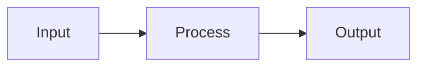

# Documentation Content

7-step content pattern and writing guidelines.

## 7-Step Pattern

```
1. ORIENT       What system? What problem solved?
                Reader knows they're in the right place

2. CONTEXTUALIZE Where does this fit? What comes before/after?
                 Reader has spatial awareness

3. EXPLAIN      How does it work? What are the moving parts?
                Reader understands the mechanism

4. TRADEOFFS    Why this approach? What alternatives?
                Reader understands reasoning

5. DEMONSTRATE  Show it working. Concrete example with output.
                Reader sees it in action

6. EDGE CASES   What breaks? What's partial? What's aspirational?
                Reader has accurate expectations

7. CONNECT      Where next? What's related?
                Reader has clear path forward
```

## Adapting by Content Type

| Type | Emphasize | De-emphasize |
|------|-----------|--------------|
| Conceptual | Orient, Contextualize, Tradeoffs | Demonstrate |
| Procedural | Demonstrate, Edge Cases | Tradeoffs |
| Reference | Explain, Edge Cases | Orient |
| Troubleshooting | Edge Cases, Connect | Contextualize |

## Writing Guidelines

**Start specific, not abstract**
- Bad: "Connectors facilitate access management integration"
- Good: "A connector syncs users, groups, and permissions from Okta"

**Rhetorical questions (sparingly)**
- "What happens when a user leaves but still has database access?"
- One per major section max

**Show before explaining**
```markdown
Here's a sync:
$ tool sync --config $CONFIG
[output]

This command: [explanation]
```

Not:
```markdown
Syncing involves three phases. First... [explanation]
[code buried later]
```

**Active voice, second person**
- Bad: "The connector is built using make build"
- Good: "Build your connector with make build"

**Sentence case for h2+**
- H1: May use title case
- H2 and below: First word and proper nouns only
- Bad: `## Getting Started With The SDK`
- Good: `## Getting started with the SDK`

**Source traceability**
```markdown
The SDK processes all builders together [VERIFIED: source.go L42].
```

**One idea per paragraph**

**Never presume difficulty**
- Bad: "You only need to run make build" (trivializing)
- Bad: "Just add the config file" (dismissive)
- Bad: "Simply call the API" (assumes familiarity)
- Good: "Run make build"
- Good: "Add the config file"
- Good: "Call the API"

## Diagrams

Use Mermaid for diagrams:

```markdown

```

Why Mermaid:
- Version-controlled text
- Diff-friendly
- No external dependencies
- Renders in GitHub, GitLab, Notion

When to use:
- System architecture
- Sequences (API calls, lifecycle)
- State machines
- Hierarchies

Keep simple: 10-15 nodes max. Split or reconsider if more.
