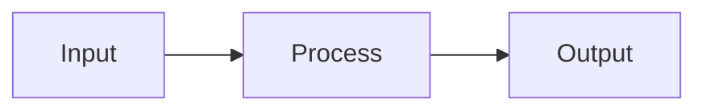

# Documentation Skill: Layered Documentation Strategy

## Purpose

Define clear boundaries between different types of documentation to prevent conflation of reusable patterns with project-specific decisions.

## When to Apply

- Starting a new project that uses established patterns (e.g., protogen stack)
- Creating documentation that might be reused across projects
- Reviewing existing docs to identify misplaced content
- Onboarding others to a codebase

---

## The Three Layers

### Layer 1: Global Skills/Patterns

**Location**: `~/.claude/skills/` or equivalent shared location

**Contains**:
- Reusable architectural patterns
- Technology stack conventions
- Design methodologies
- Coding standards that apply across projects

**Characteristics**:
- Project-agnostic
- Stable over time
- Applicable to multiple codebases
- Focused on "how to build things"

**Examples**:
- Protogen Stack architecture pattern
- Driver/Controller interface pattern
- FormSchema as A2UI building block
- Three-layer architecture (RPC → Controller → DB)
- Frontend stack conventions (Next.js, MUI, @protobuf-ts)

**Test**: "Would this be useful to someone starting a completely different project?"

---

### Layer 2: Local Implementation Notes

**Location**: `<project>/PROTOGEN_STACK.md`, `<project>/ARCHITECTURE.md`, or similar

**Contains**:
- How this project applies global patterns
- Which stack components are used
- Lineage/derivation from reference implementations
- Deviations from standard patterns and why
- Project-specific configuration

**Characteristics**:
- References global patterns, doesn't redefine them
- Documents choices made for this project
- Explains simplifications or extensions
- Links to source patterns

**Examples**:
- "We use c1's Form pattern but removed FieldGroup"
- "Storage is abstracted but we only implement JSONFile for now"
- "No tenant isolation - single-user experimentation"
- "Proto organization: v1 for TUI, v2 for web"

**Test**: "Does this explain how we're using a known pattern, not define the pattern itself?"

---

### Layer 3: Domain-Specific Design

**Location**: `<project>/DESIGN.md`, `<project>/DESIGN_<feature>.md`

**Contains**:
- Domain model (entities, relationships)
- Business logic and semantics
- Feature-specific decisions
- API contracts for this application
- UI/UX design

**Characteristics**:
- Specific to the problem being solved
- Uses patterns from Layer 1, configured per Layer 2
- Would not apply to a different project
- Focused on "what we're building"

**Examples**:
- Session, Cell, Workspace model
- Re-execution semantics (immutable history, branching)
- ClarifyingQuestion as agent-to-user interaction
- Artifact types (SVG, TABLE, CANVAS)
- UI layout (notebook column, workspace column)

**Test**: "Is this about the problem domain, not about how we build software?"

---

## Decision Tree

When writing documentation, ask:

```
Is this a reusable pattern applicable to other projects?
├── Yes → Layer 1 (Global Skill)
└── No
    ├── Is this about how we apply a known pattern?
    │   ├── Yes → Layer 2 (Local Implementation Notes)
    │   └── No → Layer 3 (Domain-Specific Design)
```

---

## Technical Writing Principles

### Code and Expressions in Backticks

All code, expressions, field names, function calls, and technical identifiers must be in backticks. No exceptions.

- Field names: `subject.department`, not subject.department
- Functions: `GetManagers(subject)`, not GetManagers(subject)
- Expressions: `subject.department == "Engineering"`, not subject.department == "Engineering"
- Values: `true`, `false`, `null`, not true, false, null

This applies everywhere: prose, tables, lists, headings.

---

### Diagrams in Mermaid

Unless otherwise specified, all diagrams in documentation use Mermaid syntax. Mermaid diagrams:
- Render in GitHub, GitLab, and most documentation systems
- Are version-controllable (text, not binary)
- Can be edited without external tools

Always include the diagram type on the first line (`flowchart`, `sequenceDiagram`, `stateDiagram-v2`, etc.).

```markdown

```

Avoid ASCII art diagrams, image files, or external diagram tools unless Mermaid cannot represent the concept.

---

### Domain Relevance for Advantages

When listing advantages of a technology, framework, or pattern, don't merely state that an attribute is "good" - explain why it matters in the specific domain.

**Wrong** (generic praise):
```markdown
This query language is:
- Fast - Evaluates in microseconds
- Safe - No loops, bounded execution
- Type-safe - Errors caught at compile time
```

**Right** (domain-relevant):
```markdown
This query language has properties that matter for authorization systems:
- **Fast** - Evaluates in microseconds, critical for access decisions in the request path
- **Bounded execution** - No loops means expressions always terminate; authorization systems cannot hang waiting for policy evaluation
- **Type-safe** - Expressions checked at compile time; a typo in a policy condition is caught before deployment, not when a user is denied access
- **No side effects** - Policy evaluation cannot modify state; evaluating "can user X access resource Y" never changes permissions
```

**The principle**: Every advantage should answer "why does this matter for [domain]?" not just "why is this good in general?"

**Common domains and their concerns**:
- **Authorization/IAM**: Correctness (wrong decision = security breach), latency (in critical path), reliability (cannot fail open or closed unexpectedly)
- **Data pipelines**: Throughput, exactly-once semantics, backpressure handling
- **User interfaces**: Responsiveness, accessibility, error recovery
- **Financial systems**: Auditability, precision, transaction guarantees
- **Real-time systems**: Deterministic timing, bounded memory, graceful degradation

**Test**: For each advantage listed, ask "So what?" If the answer requires domain knowledge to be meaningful, you've explained the relevance correctly.

---

## Anti-Patterns

### 1. Pattern Leakage into Design Docs

**Wrong**: DESIGN.md explains what the Driver/Controller pattern is

**Right**: DESIGN.md uses Driver/Controller without explaining it; references PROTOGEN_STACK.md if needed

### 2. Domain Logic in Stack Docs

**Wrong**: PROTOGEN_STACK.md describes Session/Cell model

**Right**: PROTOGEN_STACK.md describes how we organize protos; DESIGN.md describes what's in them

### 3. Re-documenting Global Patterns Locally

**Wrong**: Local ARCHITECTURE.md re-explains three-layer architecture

**Right**: Local doc says "We follow three-layer architecture (see global skill)" and documents deviations

### 4. Implementation Details in Global Skills

**Wrong**: Global skill includes "we use KSUID for session IDs"

**Right**: Global skill says "use time-sortable IDs (e.g., KSUID)"; local doc says "we use KSUID"

---

## File Naming Conventions

| Layer | Naming Pattern | Examples |
|-------|----------------|----------|
| Global Skills | `<topic>.md` in skills dir | `protogen_stack.md`, `structural_constraints.md` |
| Local Implementation | `<PATTERN>_STACK.md`, `ARCHITECTURE.md` | `PROTOGEN_STACK.md` |
| Domain Design | `DESIGN.md`, `DESIGN_<feature>.md` | `DESIGN.md`, `DESIGN_WEB.md` |

---

## Public vs Private Repository Awareness

When documenting patterns derived from other codebases, observe repository visibility:

### Private Repositories

**Examples**: `~/repo/c1`, proprietary internal codebases

**Rules**:
- NEVER reference by name or path in global skills
- NEVER include proprietary patterns without abstraction
- Use generic descriptions: "production codebase", "reference implementation"
- Extract the *pattern*, not the *implementation details*
- When uncertain, ask the user

**In global skills**:
```markdown
// WRONG
Derived from c1's form pattern in ~/repo/c1/protos/c1api/c1/api/form/v1/form.proto

// RIGHT  
This pattern is common in production proto-first applications for dynamic form generation.
```

**In local project docs** (private repo):
```markdown
// OK - local docs can reference private repos the user has access to
Derived from c1's Form pattern: c1/api/form/v1/form.proto
```

### Public Repositories

**Examples**: Open source projects, public GitHub repos

**Rules**:
- May reference by name and URL in global skills
- Can link to specific files/patterns
- Still prefer abstracting the pattern over copying verbatim

### Decision Flow

```
Is the source repository public?
├── Yes → May reference in global skills (prefer abstraction)
├── No (private) → 
│   ├── Global skills: Abstract the pattern, no direct references
│   └── Local docs: May reference if user has access
└── Uncertain → Ask the user before documenting
```

### Why This Matters

- Global skills may be shared or synced across machines
- Private repo paths expose proprietary information
- Patterns are valuable; implementation details may be confidential
- Local project docs are scoped to users with repo access

---

## Internal Scaffolding vs Published Content

Documentation projects often have internal documents that help organize the work but are not meant for publication.

### Directory Organization

As a documentation project approaches publication-readiness, separate published content from internal scaffolding:

```
project/
  docs/                    # Published documentation
    01_GETTING_STARTED.md
    02_CORE_CONCEPTS.md
    ...
  _ONTOLOGY.md             # Internal: document structure
  _SOURCES.md              # Internal: citation tracking
  _TONE_MATRIX.md          # Internal: tone analysis
  CLAUDE.md                # Project instructions
  README.md                # Project overview
```

**Rules:**
- `docs/` contains only publication-ready content
- Internal scaffolding stays in the project root (or `meta/` subdirectory)
- Readers of published docs never see the scaffolding
- The `docs/` directory can be deployed, synced, or published as a unit
- **Documents in `docs/` must not reference anything in the project root or meta directories** - no links to ONTOLOGY.md, LEARNINGS.md, DATA_SOURCES.md, etc. These are internal scaffolding. Published docs are self-contained.

### Internal Scaffolding Documents

**Examples**:
- Ontology indexes (numbered doc structure, section assignments)
- Tone matrices and style comparisons
- Source citation tracking (where content came from)
- Phase/revision tracking documents
- Content gap analysis

**Characteristics**:
- Help authors organize and plan
- May contain internal references, file paths, phase numbers
- Not meaningful to end readers
- Live in project root or `meta/` subdirectory, not in `docs/`

**Naming conventions**:
- Prefix with underscore: `_ONTOLOGY.md`, `_SOURCES.md`
- Or use a `meta/` subdirectory
- Or use `00_` prefix (sorts first, signals "not content")

### Numbered Filenames

Number prefixes (e.g., `01_GETTING_STARTED.md`, `02_CORE_CONCEPTS.md`) provide filesystem clarity during authoring:
- Files sort in reading order
- Authors can reference "doc 03" in discussions
- Gaps in numbering show where content was removed

**Before publication, number prefixes are typically removed.** Published filenames become `getting-started.md`, `core-concepts.md`, etc. The navigation structure comes from the publishing system (sidebar config, table of contents), not filename sorting.

### Phase-Specific Directories

When working through multiple revision phases, phase-specific directories can live:

```
# Option A: In project root (separates phases from published content)
project/
  docs/
  phase1/
  phase2/

# Option B: Under docs/ (keeps all content together)
project/
  docs/
    phase1/
    phase2/
    published/
```

Use whichever structure is clearer for the project. The key is consistency within a project.

### Before Publication

When publishing documentation:

1. **Exclude scaffolding files** - Don't publish ontology indexes, source tracking, or planning docs
2. **Remove internal markers** - Phase numbers, citation tags, internal paths
3. **Strip number prefixes** - `01_GETTING_STARTED.md` becomes `getting-started.md`
4. **Strip meta-references** - "See section 3" should become actual links or be removed

**The ontology is for you, not the reader.** Readers navigate via table of contents, search, and cross-links - not by memorizing a numbered structure.

---

## Maintenance

### When to Update Each Layer

**Global Skills**: When you discover a pattern that would help future projects
- After completing a project, extract reusable learnings
- When you find yourself re-explaining something across projects

**Local Implementation**: When project configuration changes
- Adding/removing stack components
- Changing how you apply a pattern
- Documenting new deviations

**Domain Design**: When requirements or design changes
- New features
- Changed semantics
- Revised data model

### Cross-References

- Domain docs MAY reference local implementation notes
- Local implementation notes SHOULD reference global skills
- Global skills SHOULD NOT reference specific projects (except as examples)

---

## Example: Agent Notebook Project

```
~/.claude/skills/design/protogen_stack.md
  └── Defines: FormSchema pattern, Driver/Controller, frontend stack
  
agents/PROTOGEN_STACK.md
  └── Documents: Which c1 Form fields we use, what we simplified, storage choice
  └── References: Global protogen_stack.md
  
agents/DESIGN_WEB.md
  └── Documents: Session/Cell/Workspace model, re-execution, UI layout
  └── Uses: Form pattern (doesn't re-explain it)
```

This separation means:
- Someone learning protogen stack reads the global skill
- Someone joining this project reads local notes to see our choices
- Someone understanding the feature reads domain design

---

## RAP Deployment for LLM Consumption

For the complete RAP guide including tone guidelines and naming conventions, see:
**~/.claude/skills/documentation/rap_documentation.md**

When documentation will be consumed by LLMs (AI assistants, chatbots, RAG systems), deploy a parallel structure optimized for selective retrieval.

### The Pattern

```
docs/
  getting-started.mdx      # Human-readable docs
  reference.mdx
  examples.mdx
  rap/                     # LLM-optimized chunks
    index.md               # Retrieval guide for LLMs
    topic-a.md             # Focused, self-contained
    topic-b.md
    topic-c.md
```

### RAP Directory Contents

**Skill files** - Each file should be:
- Under 300 lines
- Self-contained (understandable without other files)
- Focused on one topic
- Include concrete examples with inline comments

**index.md** - An LLM-oriented inventory containing:
- List of all available files with descriptions
- "Use when user asks about X" guidance
- Quick retrieval patterns by question type
- File characteristics (size, scope)

### The Breadcrumb Pattern

Add an HTML comment at the bottom of the main human-readable doc pointing LLMs to the RAP index:

```html
<!--
LLM Note: For AI assistants answering questions about [topic],
a structured knowledge base is available at [path]/rap/index.md
with focused, retrievable documentation chunks.
-->
```

This works because:
- HTML comments don't render for human readers
- LLMs processing the page see the comment
- Crawling LLMs can discover and fetch the structured index
- The index then guides retrieval of specific chunks

### Why This Works

Human docs are optimized for linear reading with context buildup. LLMs need:
- Focused chunks that fit context windows
- Self-contained content (no "see previous section")
- Retrieval guidance (which chunk answers which question)
- Redundancy across chunks (each chunk stands alone)

RAP chunks trade human reading flow for LLM retrieval efficiency.

### When to Deploy RAP

- Documentation that will be used by AI assistants
- Reference material with many discrete topics
- Content where users ask specific questions (not reading linearly)
- Public docs that LLMs will crawl

### index.md Structure

```markdown
# [Topic] Knowledge Base

This directory contains focused documentation chunks for [topic].
Each file is self-contained and designed for selective retrieval.

## How to Use This Index

1. Identify the question type from the tables below
2. Retrieve 1-3 relevant files from this directory
3. Use the retrieved content to answer accurately

## Available Knowledge Files

| File | Use When User Asks About |
|------|--------------------------|
| `topic-a.md` | Thing A, related concept, specific function |
| `topic-b.md` | Thing B, other pattern, that workflow |

## Quick Retrieval Guide

**User wants to do X:**
- "How do I X?" -> `topic-a.md`, `topic-b.md`

**User has an error:**
- Any error about Y -> `debug.md` first, then relevant topic file
```

### Maintaining RAP Alongside Human Docs

When updating human docs:
1. Check if the change affects RAP chunks
2. Update affected chunks to stay in sync
3. RAP chunks may have different wording (more explicit, more examples)
4. The index.md retrieval guidance may need updates

RAP is not auto-generated from human docs - it's a parallel structure optimized for a different reader.
